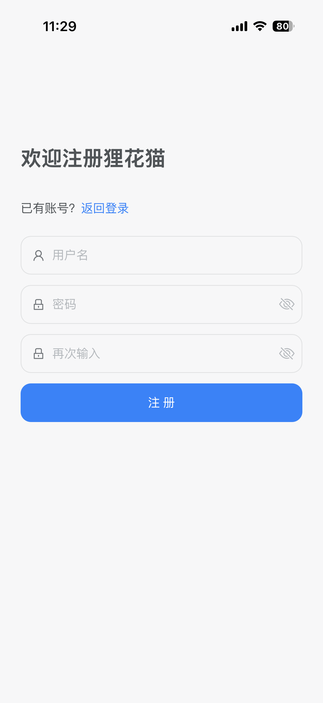
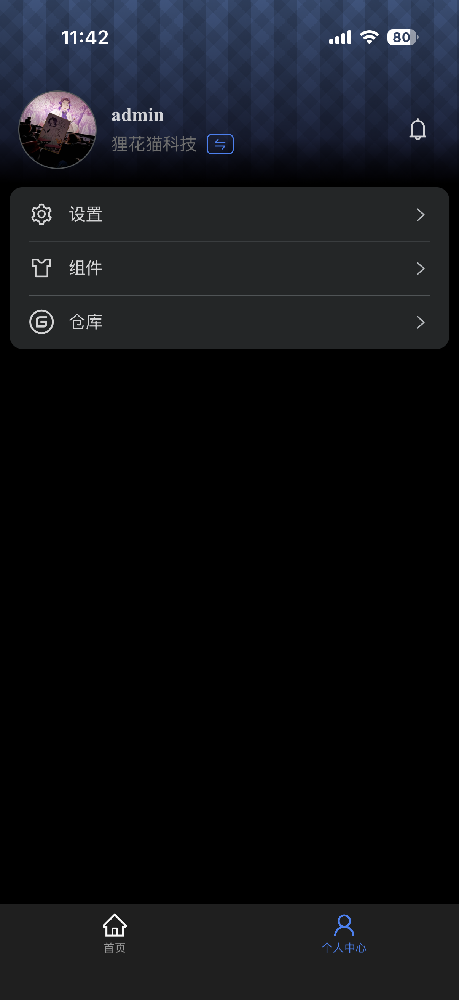

# Lihua App

这是一个基于 Vue 和 TypeScript 的跨平台应用程序，旨在提供现代化的移动体验。

## 功能特性

- 使用 Vue 3 和 TypeScript 编写
- 支持跨平台运行（包括微信小程序等）
- 提供了丰富的 UI 组件和工具函数
- 包含状态管理、网络请求、加密等功能

## 项目截图
<div style="display:flex; flex-wrap:wrap; gap:8px;">
	
	
	
	
	
	
</div>

## 目录结构

```
├── .env.development                # 开发环境配置文件
├── .env.production                 # 生产环境配置文件
├── .gitignore                      # Git 忽略文件配置
├── LICENSE                         # 项目许可证
├── index.html                      # 入口 HTML 文件
├── package.json                    # 项目依赖和脚本配置
├── plugins/buildIcons.ts           # 图标构建脚本
├── shims-uni.d.ts                  # Uni-app 类型声明文件
├── src/                            # 源代码目录
│   ├── App.vue                     # 根 Vue 组件
│   ├── AppRoot.vue                 # 应用根组件
│   ├── api/                        # API 接口定义
│   ├── components/                 # 公共组件
│   ├── env.d.ts                    # 环境变量类型定义
│   ├── main.ts                     # 应用入口文件
│   ├── manifest.json               # 应用清单文件
│   ├── pages.json                  # 页面配置文件
│   ├── pages/                      # 页面组件
│   ├── router/                     # 路由配置
│   ├── shime-uni.d.ts              # Uni-app 类型声明文件
│   ├── static/                     # 静态资源
│   ├── stores/                     # 状态管理
│   ├── subpackages/                # 子包模块
│   ├── theme.json                  # 主题配置文件
│   ├── uni.scss                    # 全局样式文件
│   ├── utils/                      # 工具函数
│   └── vite.config.ts              # Vite 配置文件
```

## 许可证

本项目采用 MIT 许可证。详情请查看 LICENSE 文件。

